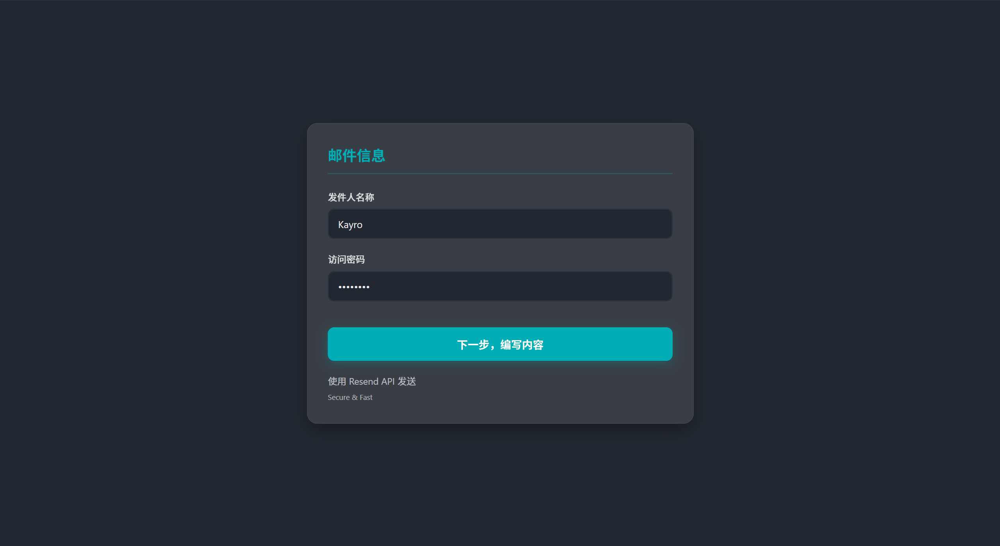
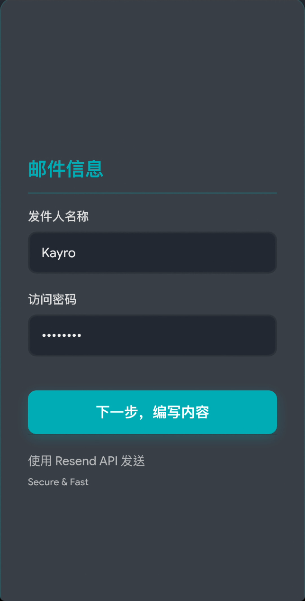
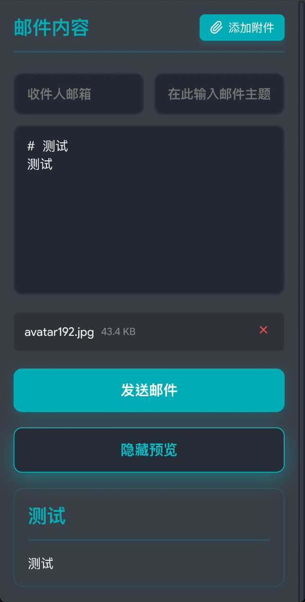
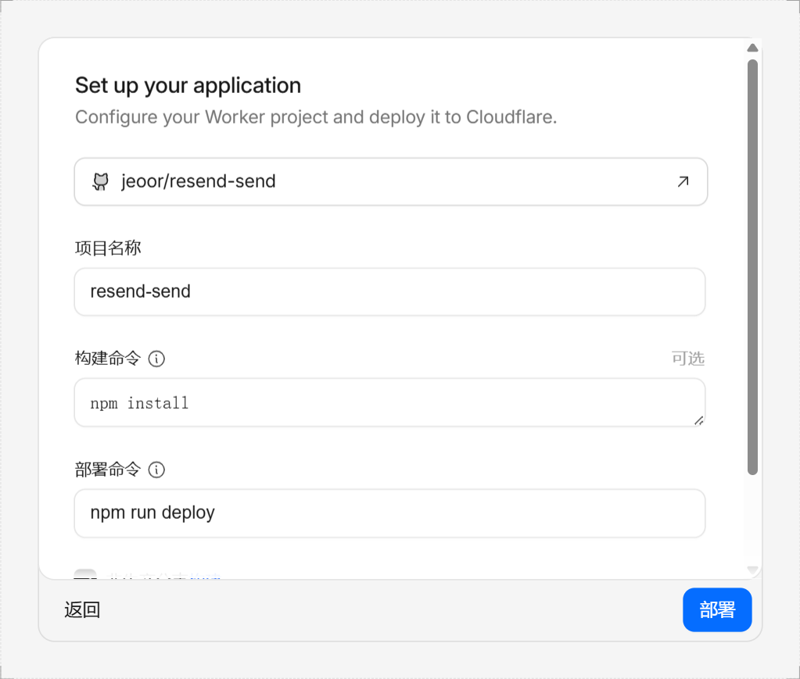
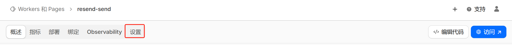
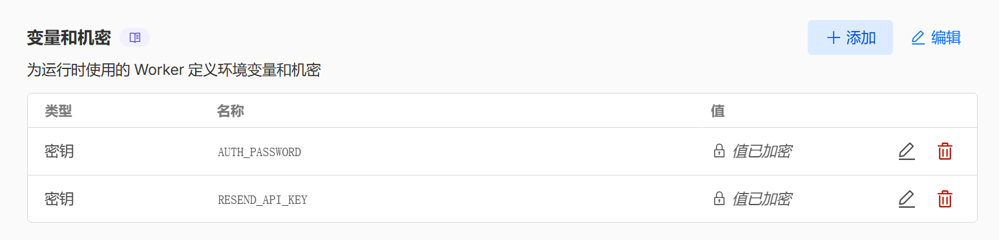
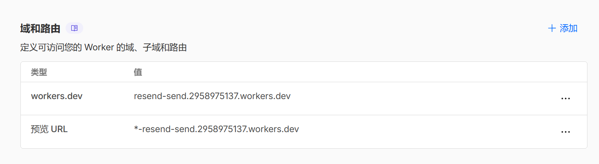

# resend-send
像使用邮件客户端一样使用你的域名邮箱

一个简单的Web应用，利用 [Resend](https://resend.com/) API 便利地发送邮件，让你拥有类似于邮件客户端的使用体验

本项目需要部署到 [Cloudflare](https://dash.cloudflare.com/) Workers 上使用，无需准备环境和服务器，可以直接在浏览器访问 worker 地址或自定义域名访问

---
## 功能
- 用 [Markdown](https://docs.github.com/zh/get-started/writing-on-github/getting-started-with-writing-and-formatting-on-github/basic-writing-and-formatting-syntax) 编写邮件内容，支持预览
- 可以发送附件

---
## 预览截图
1. 电脑



2. 手机

 

---
##  你需要的
- 一个[自己的域名](https://www.namesilo.com/)和[域名邮箱](https://developers.cloudflare.com/email-routing/)
- 一个[Resend API Key](https://developers.cloudflare.com/workers/tutorials/send-emails-with-resend/)
- 一个 [Cloudflare 账号](https://dash.cloudflare.com/)
- 熟悉 [Markdown 语法](https://docs.github.com/zh/get-started/writing-on-github/getting-started-with-writing-and-formatting-on-github/basic-writing-and-formatting-syntax)

---
## 如何部署
又两种方式部署，一个需要Fork本仓库，一个不需要
### 1. Fork 本仓库
1. Fork 本仓库到你的 GitHub 账号下
2. 进入 [Cloudflare 仪表盘](https://dash.cloudflare.com/)
3. 点击左栏的`计算与 AI`，进入`Workers 和 Pages`页面

4. 点击`创建应用程序`

5. 选择`Continue with GitHub`

6. 如下图配置应用后部署

- 选择刚才Fork的仓库
- 构建命令（安装wrangler）
```bash
npm install
```
- 部署命令
```bash
npx run deploy
```
7. 部署好后进入 Worker 的设置

8. 设置 [Resend API Key](https://resend.com/api-keys) 和访问密码环境变量

如上图设置两个`密钥`类型的环境变量：`RESEND_API_KEY` 和 `
AUTH_PASSWORD`，保存并部署
9. 设置自定义域名方便记忆（可选）

10. 访问Worker

### 2. 不需要 Fork
1. `复制`本仓库 `worker.js` 的内容
2. 完成`上一节`的`第2步到第4步`
3. 选择`从 Hello World! 开始`，然后点击部署

4. 点击进入部署好的 Worker 界面，点击右上角的`编辑代码`

5. `粘贴`刚才复制的代码，点击右上角`部署`

6. 完成`上一节`的第`7步到第10步`

---
## 使用方法
1. 登录界面输入设置的密码，登录，名字可以随便填
2. 用 [Markdown](https://docs.github.com/zh/get-started/writing-on-github/getting-started-with-writing-and-formatting-on-github/basic-writing-and-formatting-syntax) 编辑邮件，发送

---
祝你使用愉快！如果有任何问题，欢迎在仓库中提出 issue。